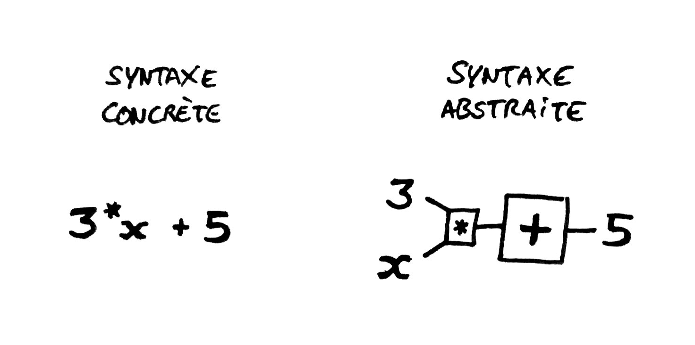

# Articles

####[L’avenir de la programmation (2/6) : La programmation pour les non-programmeurs — InternetActu](http://www.internetactu.net/2011/05/24/lavenir-de-la-programmation-26-la-programmation-pour-les-non-programmeurs/)

####[Visual Programming Is Unbelievable… Here’s Why We Don’t Believe In It](https://www.outsystems.com/blog/2015/03/visual-programming-is-unbelievable.html)

# Définitions

####[Langage graphique — Wikipédia](https://fr.wikipedia.org/wiki/Langage_graphique)
> Un langage de programmation **graphique ou visuel** est un **langage de programmation** dans lequel **les programmes sont écrits par _assemblage d'éléments graphiques_**. Sa syntaxe concrète est composée de **symboles graphiques** et de **textes**, qui sont **disposés _spatialement_ pour former des _programmes_**. De nombreux langages visuels se basent sur les notions « de **boîtes et de flèches** » : les boîtes (ou d'autres d'objets) sont traités comme des **entités**, **reliées par des _flèches_ ou des _lignes_** qui représentent des **relations**.

> Plus précisément, un langage est défini par une **_syntaxe abstraite_**, à laquelle **sont associées une ou plusieurs _syntaxes concrètes_**, parmi lesquelles une ou plusieurs peuvent être graphiques.

> Généralement ces langages sont **associés à un _environnement graphique_ de programmation**. Il n'est pas _toujours possible de les dissocier_. Il faut également **faire la distinction entre le _langage au sens "normalisé"_ et son _implémentation au sens "logiciel"_**.

##### Langage de programmation : 
Notation conventionnelle destinée à _formuler des algorithmes_ et produire des programmes informatiques qui les appliquent. D'une manière similaire à une langue naturelle, un langage de programmation est composé d'un _alphabet_, d'un _vocabulaire_, de _règles de grammaire_, et de _significations_. Un langage de programmation est mis en œuvre par un traducteur automatique : _compilateur ou interpréteur_. Chaque langage de programmation reflète un _paradigme_, un ensemble de notions qui orientent le travail de réflexion du programmeur, sa technique de programmation et _sa manière d'exprimer le fruit de ses réflexions dans le langage choisi_. ([Wikipédia](https://fr.wikipedia.org/wiki/Langage_de_programmation))

##### Assemblage d'éléments graphiques :
Association d'entités, juxtaposition, imbrication, superposition, liaison

##### Symboles graphiques :
Boîtes, lignes, plans, points, boutons

##### Disposition spatiale : 

##### Former des programmes : 
En informatique, un programme est un ensemble d'instructions destinées à être exécutées par un ordinateur. ([Wikipédia](https://fr.wikipedia.org/wiki/Programme))

##### Entités : 
Objet, « chose », élément sémantique identifiable

##### Relations : 
Relier par des lignes (parallèle) ou par des flèches (cause / conséquence, suite)

##### Syntaxe abstraite / Syntaxe concrète : 
Dans la définition formelle des langages de programmation, la syntaxe abstraite s'oppose à la syntaxe concrète : tandis que cette dernière représente _les suites de caractères que l'utilisateur doit taper_, la syntaxe abstraite tend à donner une _structure aux données entrées, suggérant au passage la façon de les stocker en mémoire_.

Par exemple, considérant une expression arithmétique dont la _syntaxe concrète est 3*x+5_, sa _syntaxe abstraite pourra être un arbre_ dont la racine est un nœud +, de branche gauche un nœud * (ayant comme branche les feuilles 3 et x), de branche droite une feuille 5. ([Wikipédia](https://fr.wikipedia.org/wiki/Syntaxe_abstraite))

##### Environnement graphique de programmation : 
Interface accessible par l'utilisateur afin de manipuler des éléments de programmation

Définition associée :
En programmation informatique, un environnement de développement est un _ensemble d'outils pour augmenter la productivité des programmeurs_ qui développent des logiciels. Il comporte un _éditeur de texte_ destiné à la programmation, des _fonctions_ qui permettent, par _pression sur un bouton_, de démarrer le compilateur ou l'éditeur de liens ainsi qu'un débogueur en ligne, qui permet d'exécuter ligne par ligne le programme en cours de construction. ([Wikipédia](https://fr.wikipedia.org/wiki/Environnement_de_d%C3%A9veloppement))

####[Visual Programming Language — Wikipédia](https://en.wikipedia.org/wiki/Visual_programming_language)
> In computing, a visual programming language (VPL) is any programming language that lets users create programs by manipulating program elements graphically rather than by specifying them textually. A VPL allows programming with visual expressions, spatial arrangements of text and graphic symbols, used either as elements of syntax or secondary notation. For example, many VPLs (known as dataflow or diagrammatic programming) are based on the idea of "boxes and arrows", where boxes or other screen objects are treated as entities, connected by arrows, lines or arcs which represent relations.

####[Deutsch limit — Wikipédia](https://en.wikipedia.org/wiki/Deutsch_limit)
> The Deutsch limit is an aphorism about the information density of visual programming languages originated by L Peter Deutsch that states:

> The problem with visual programming is that you can’t have more than 50 visual primitives on the screen at the same time.

####[Smalltalk — Wikipédia](https://fr.wikipedia.org/wiki/Smalltalk)
> Smalltalk est un langage de programmation orienté objet, réflexif et dynamiquement typé. Il fut l'un des premiers langages de programmation à disposer d'un environnement de développement intégré complètement graphique. Il a été créé en 1972. Il est inspiré par les langages Lisp et Simula. Il a été conçu par Alan Kay, Dan Ingals, Ted Kaehler, Adele Goldberg (en) au Palo Alto Research Center de Xerox.

####[Mental model — Wikipédia](https://en.wikipedia.org/wiki/Mental_model)
> A mental model is an explanation of someone's thought process about how something works in the real world. It is a representation of the surrounding world, the relationships between its various parts and a person's intuitive perception about his or her own acts and their consequences. Mental models can help shape behaviour and set an approach to solving problems (akin to a personal algorithm) and doing tasks.