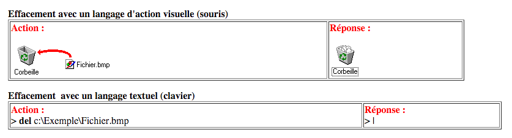

## Articles

####[✖ L’avenir de la programmation (2/6) : La programmation pour les non-programmeurs — InternetActu](http://www.internetactu.net/2011/05/24/lavenir-de-la-programmation-26-la-programmation-pour-les-non-programmeurs/)

####[✖ Visual Programming Is Unbelievable… Here’s Why We Don’t Believe In It](https://www.outsystems.com/blog/2015/03/visual-programming-is-unbelievable.html)

####[✖ Programmation événementielle et visuelle : application en Windows](http://rmdiscala.developpez.com/cours/LesChapitres.html/Cours5/Chap5.4.htm)
> Le raisonnement communément admis est qu'un dessin associé à une action élémentaire est plus porteur de sens qu'une phrase de texte. A titre d'exemple ci-dessous l'on enlève le "fichier.bmp" afin de l'effacer selon deux modes de communication avec la machine: utilisation d'icônes ou entrée d'une commande textuelle.

> Le programmeur trouve actuellement, une offre importante en outil de développement de RAD visuel. Nous proposons de définir un langage de RAD visuel ainsi : 
 
> Un langage visuel dans un RAD visuel est un générateur de code source du langage de base qui, derrière chaque action visuelle (dépôt de contrôle, click de souris, modifications des propriétés, etc...) engendre des lignes de code automatiquement et d'un manière transparente au développeur.